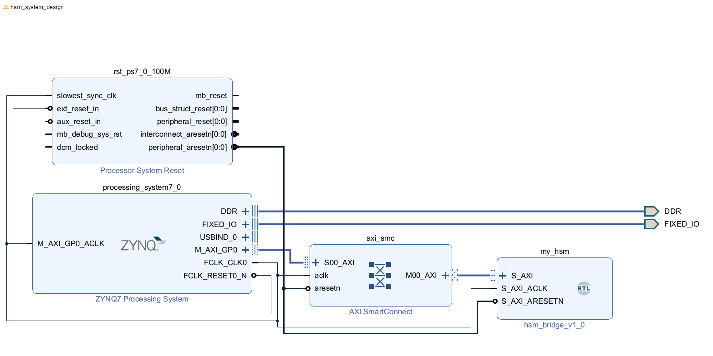

# PYNQ HSM
Hardware Security Module on PYNQ-Z2 

## Status
- [x] **v0.1.0** - AXI-Lite register interface working
- [x] **v0.2.0** - TRNG w/ Ring oscillator entropy source 
- [x] **v0.3.0** - Validated TRNG (Von Neumann Debiaser + Handshake logic) 
- [x] **v0.3.1** - Dithered Decimator + NIST SP 800-90B Health Monitor
- [ ] **v0.4.0** - AES-256 Encryption Core 
- [ ] **v0.5.0** -  Secure Key Storage

## Architecture/Block Design
### HDL Block Diagram


### Overview
The HSM is implemented in HDL and communicates with the Processing system via AXI4-Lite.
`[ARM Core(Linux)] <---> [AXI] <---> [HSM Core]`

### TRNG Design (v0.3.1)
1. **Entropy Source:** 4 Ring Oscillators with prime stage counts (13, 17, 19, 23)
2. **Dithered Decimator:** Wait interval varies each sample using `raw_bit` entropy, breaking phase locking that caused chi-square regression in v0.3.0
3. **Whitening:** Von Neumann Debiaser eliminates bias
4. **Accumulator:** Collects 32 valid bits per sample
5. **Health Monitor:** NIST SP 800-90B compliant — RCT and APT tests run continuously on the post-VN bit stream, results exposed in STATUS register bits [10:8]


## Verification & Benchmarks 

Randomness was verified using the **ENT** statistical analysis tool.

### Results
| Metric | v0.2.0 | v0.3.0 (broken decimator) | **v0.3.1** | Industry Std | Verdict |
|--------|--------|--------------------------|------------|--------------|---------|
| **Entropy** | 7.935 | 7.636 | **7.973** | > 7.9 | PASS |
| **Compression** | 0% | 4% | **0%** | 0% | PASS |
| **Chi-Square** | 83,908 | 546,078 | **37,929** | < 100k | PASS |
| **Mean** | 127.39 | 127.80 | **128.35** | 127.5 | PASS |
| **Serial Correlation** | - | -0.131 | **0.016** | ~0.0 | PASS |

### Quick Start

1. **Build & Deploy**

**Windows (Vivado):** <br>
- Run/Generate bitstream in vivado
- Program in vivado

**Mac/Linux (Software)** <br>
- Connect via Ethernet
- Run `make upload` to send driver to board

2. **Run Driver**
SSH into board and compile driver
```bash
ssh xilinx@...
g++ -o test_hsm test_hsm.cpp
```

3. **Usage Modes**
```bash
sudo ./test_hsm              # text mode: health check + random values
sudo ./test_hsm --binary     # binary capture for ENT analysis  
sudo ./test_hsm --health     # live health dashboard
```