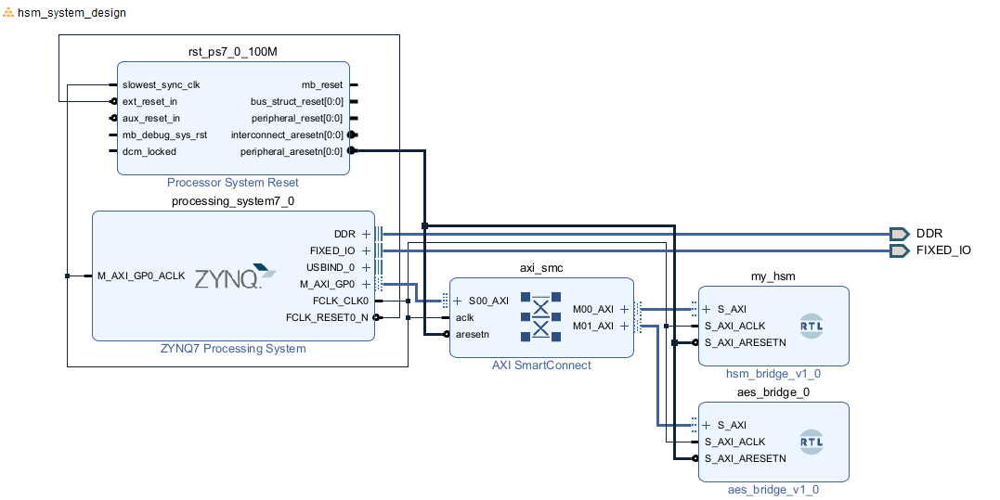

# PYNQ HSM
Hardware Security Module on PYNQ-Z2 

## Status
- [x] **v0.1.0** - AXI-Lite register interface working
- [x] **v0.2.0** - TRNG w/ Ring oscillator entropy source 
- [x] **v0.3.0** - Validated TRNG (Von Neumann Debiaser + Handshake logic) 
- [x] **v0.3.1** - Dithered Decimator + NIST SP 800-90B Health Monitor
- [x] **v0.4.0** - AES-256 Encryption Core 
- [ ] **v0.5.0** -  Hardware key injection (TRNG -> AES, no SW exposure)

## Architecture/Block Design
### HDL Block Diagram


### Overview
The HSM is implemented in HDL and communicates with the Processing system via AXI4-Lite.
`[ARM Core(Linux)] <---> [AXI] <---> [HSM Core] & [AES Core]`

Two independent AXI-Lite peripherals on separate SmartConnect ports:
| Peripheral | Base Address | Size | Function |
| ---------- | ------------ | ---- | -------- |
| `my_hsm` | `0x4000_0000` | 4KB | TRNG Ctrl, health status, rand out |
| `aes_bridge` | `0x4000_1000` | 4KB | AES-256 key load, encrypt, ciphertext readback |


### TRNG Design (v0.3.1)

1. __Entropy Source:__ 4 ring oscillators with prime stage counts (13, 17, 19, 23 inverters)
2. __Dithered Decimator:__ Wait interval varies each sample using raw_bit entropy, breaking phase locking
3. __Whitening:__ Von Neumann debiaser eliminates bias
4. __Accumulator:__ Collects 32 valid bits per sample
5. __Health Monitor:__ NIST SP 800-90B compliant — RCT and APT tests run continuously, results in STATUS register bits [10:8]

### AES-256 Design (v0.4.0)

1. __Architecture:__ Iterative — 1 round per clock cycle, 16 parallel S-boxes
2. __Key Schedule:__ AES-256 key expansion (FIPS 197 §5.2), 52 cycles for 60-word schedule
3. __Encryption:__ 14 rounds — SubBytes → ShiftRows → MixColumns → AddRoundKey (MixColumns skipped on round 14)
4. __Latency:__ 52 cycles key expansion + 14 cycles per block @ 100 MHz
5. __Interface:__ AXI-Lite register bank — 8 key words, 4 plaintext words, 4 ciphertext words, control/status

## Verification
### AES-256 Verification (v0.4.0)
Staged verification methodology with independent golden models — no external crypto libraries.
**Stage 1 — S-box (simulation):**
Python computes all 256 S-box entries from GF(2^8) math (FIPS 197 §5.1.1). SV testbench exhaustively checks RTL against golden hex file. 

**Stage 2 — AES Core (simulation):**
Python implements full AES-256 from mathematical primitives. SV testbench loads key, encrypts, compares ciphertext.

**Stage 3 — Hardware (PYNQ-Z2):**
C++ test driver writes key/plaintext via AXI-Lite, reads ciphertext, compares against same golden vectors.

**Timing:** WNS +0.021ns after post-route physical optimization. Zero failing endpoints.

### TRNG Verification (v0.3.1)

Randomness was verified using the **ENT** statistical analysis tool.

### Results
| Metric | v0.2.0 | v0.3.0 (broken decimator) | **v0.3.1** | Target | Verdict |
|--------|--------|--------------------------|------------|--------------|---------|
| **Entropy** | 7.935 | 7.636 | **7.973** | > 7.9 | PASS |
| **Compression** | 0% | 4% | **0%** | 0% | PASS |
| **Chi-Square** | 83,908 | 546,078 | **37,929** | < 100k | PASS |
| **Mean** | 127.39 | 127.80 | **128.35** | 127.5 | PASS |
| **Serial Correlation** | - | -0.131 | **0.016** | ~0.0 | PASS |

### Quick Start

1. **Build & Deploy**

**Windows (Vivado):** <br>
- Run/Generate bitstream in vivado
- Program in vivado

**Mac/Linux (Software)** <br>
- Connect via Ethernet
- Run `make upload` to send driver to board

2. **Run Driver**
SSH into board and compile driver
```bash
ssh xilinx@...
g++ -o test_hsm test_hsm.cpp
```

3. **Usage Modes**
```bash
sudo ./test_hsm              # text mode: health check + random values
sudo ./test_hsm --binary     # binary capture for ENT analysis  
sudo ./test_hsm --health     # live health dashboard
```

## Whats Next: v0.5.0 - Hardware Key Injection

The current design passes encryption keys through software-visible AXI registers. v0.5.0 closes this gap by adding a hardware key injection path: the TRNG output feeds directly into the AES key register bank within the PL fabric. The key never appears on the AXI bus, never enters ARM-accessible memory, and is never visible to software. Software issues a "generate key" command and gets back a "key loaded" status — it never sees the key material itself.
This is the defining property of a hardware security module: the device performs cryptographic operations using keys it holds internally, and those keys are never exposed to the host.